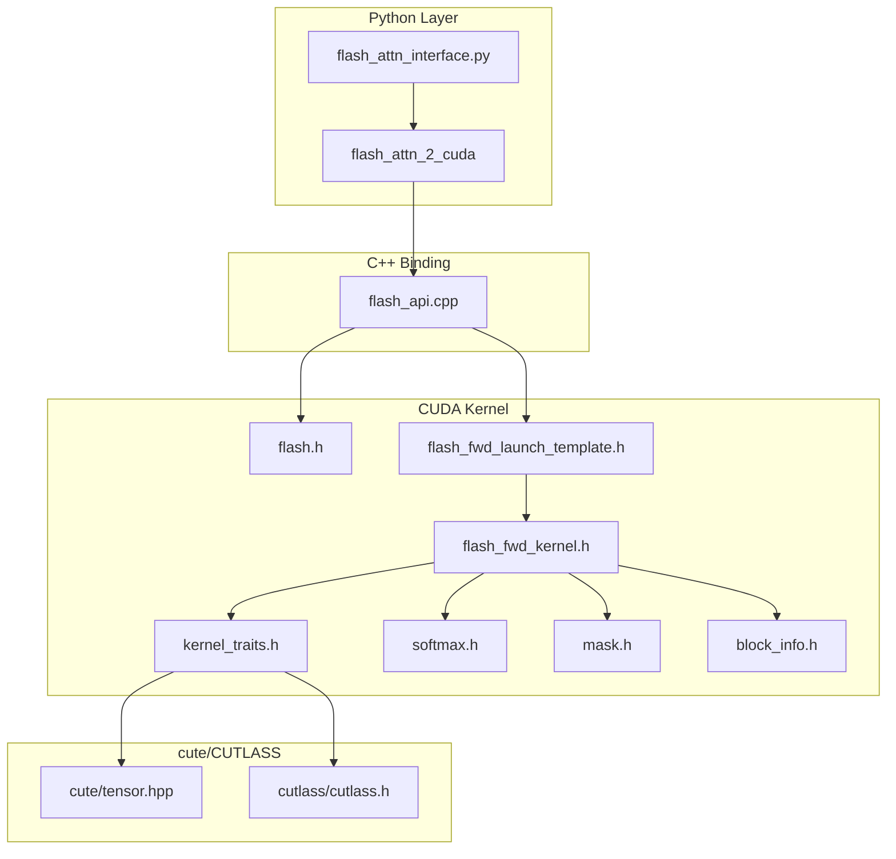

# 代码目录结构

> FlashAttention-2 学习计划 · 第四阶段 · 代码结构总览

---

## 📖 本章概述

FlashAttention 代码库包含 Python 接口层和 CUDA 核心实现层。理解代码目录结构是深入学习具体实现的第一步。

**核心发现：** FlashAttention 的代码组织遵循清晰的分层设计：
1. **Python 层**：用户接口和 PyTorch 集成
2. **C++/CUDA 层**：核心算法实现，基于 CUTLASS/cute

```
┌─────────────────────────────────────────────────────────────────┐
│                    FlashAttention 代码架构                       │
├─────────────────────────────────────────────────────────────────┤
│                                                                  │
│   Python Layer                                                  │
│   ┌──────────────────────────────────────────────────────┐      │
│   │  flash_attn/                                          │      │
│   │    ├── flash_attn_interface.py  # 用户调用入口        │      │
│   │    ├── layers/                  # 高级模块封装        │      │
│   │    └── models/                  # 完整模型实现        │      │
│   └──────────────────────────────────────────────────────┘      │
│                           ↓ pybind11                            │
│   C++/CUDA Layer                                                │
│   ┌──────────────────────────────────────────────────────┐      │
│   │  csrc/flash_attn/                                     │      │
│   │    ├── flash_api.cpp            # PyTorch C++绑定     │      │
│   │    └── src/                     # CUDA Kernel实现     │      │
│   └──────────────────────────────────────────────────────┘      │
│                                                                  │
└─────────────────────────────────────────────────────────────────┘
```

---

## 1. 顶层目录结构

```
flash-attention/
├── flash_attn/              # ⭐ Python包：用户接口层
├── csrc/                    # ⭐ C++/CUDA源码：核心实现层
│   └── flash_attn/          # FlashAttention CUDA实现
├── hopper/                  # ⭐ Hopper架构(SM90)优化实现
├── benchmarks/              # 性能基准测试
├── tests/                   # 单元测试
├── training/                # 训练示例和配置
├── examples/                # 使用示例
├── setup.py                 # Python包安装脚本
└── README.md                # 项目说明
```

---

## 2. Python 接口层：`flash_attn/`

```
flash_attn/
├── __init__.py                      # 包入口
├── flash_attn_interface.py          # ⭐⭐⭐ 核心接口，用户直接调用
├── bert_padding.py                  # BERT padding处理工具
│
├── layers/                          # 高级层封装
│   ├── rotary.py                    # 旋转位置编码(RoPE)
│   └── patch_embed.py               # Vision Transformer的Patch Embedding
│
├── modules/                         # 完整模块封装
│   ├── mha.py                       # ⭐ Multi-Head Attention模块
│   ├── mlp.py                       # MLP模块
│   ├── block.py                     # Transformer Block
│   └── embedding.py                 # Embedding层
│
├── models/                          # 预训练模型实现
│   ├── gpt.py                       # GPT系列
│   ├── llama.py                     # LLaMA系列
│   ├── bert.py                      # BERT
│   ├── falcon.py                    # Falcon
│   ├── opt.py                       # OPT
│   └── vit.py                       # Vision Transformer
│
├── ops/                             # 底层操作封装
│   ├── fused_dense.py               # 融合的Dense层
│   ├── layer_norm.py                # LayerNorm
│   ├── rms_norm.py                  # RMSNorm
│   └── activations.py               # 激活函数
│
├── losses/                          # 损失函数
│   └── cross_entropy.py             # 融合的CrossEntropy
│
├── utils/                           # 工具函数
│   ├── benchmark.py                 # 性能测试工具
│   ├── distributed.py               # 分布式训练支持
│   └── generation.py                # 文本生成工具
│
└── cute/                            # ⭐ 新版cute-based实现(实验性)
    ├── flash_fwd.py                 # cute前向实现
    ├── flash_bwd.py                 # cute反向实现
    └── interface.py                 # cute版本接口
```

### 2.1 核心文件：`flash_attn_interface.py`

这是用户最常调用的文件，提供以下主要函数：

| 函数 | 功能 | 使用场景 |
|------|------|----------|
| `flash_attn_func` | 标准FlashAttention | 固定长度序列 |
| `flash_attn_varlen_func` | 变长序列版本 | padding-free训练 |
| `flash_attn_qkvpacked_func` | QKV打包版本 | 自注意力优化 |
| `flash_attn_kvpacked_func` | KV打包版本 | 交叉注意力 |
| `flash_attn_with_kvcache` | KV Cache版本 | 推理加速 |

```python
# 使用示例
from flash_attn import flash_attn_func

# 标准调用
output = flash_attn_func(
    q, k, v,
    dropout_p=0.0,
    softmax_scale=None,
    causal=True
)
```

---

## 3. C++/CUDA 核心层：`csrc/flash_attn/`

```
csrc/flash_attn/
├── flash_api.cpp                    # ⭐ API入口，PyTorch C++绑定
└── src/
    ├── flash.h                      # ⭐ 核心数据结构定义
    │
    │   ── 前向传播相关 ──
    ├── flash_fwd_kernel.h           # ⭐⭐⭐ 前向kernel核心实现
    ├── flash_fwd_launch_template.h  # 前向kernel启动模板
    ├── flash_fwd_hdim*.cu           # 预编译的前向kernel实例
    ├── flash_fwd_split_hdim*.cu     # Split-KV版本的kernel实例
    │
    │   ── 反向传播相关 ──
    ├── flash_bwd_kernel.h           # 反向kernel核心实现
    ├── flash_bwd_launch_template.h  # 反向kernel启动模板
    ├── flash_bwd_preprocess_kernel.h # 反向预处理kernel
    ├── flash_bwd_hdim*.cu           # 预编译的反向kernel实例
    │
    │   ── 核心组件 ──
    ├── kernel_traits.h              # ⭐ Kernel配置traits
    ├── block_info.h                 # 块信息处理
    ├── softmax.h                    # ⭐ Online Softmax实现
    ├── mask.h                       # Causal/Local mask实现
    │
    │   ── 可选功能 ──
    ├── dropout.h                    # Dropout实现
    ├── rotary.h                     # RoPE旋转位置编码
    ├── alibi.h                      # ALiBi位置编码
    │
    │   ── 工具文件 ──
    ├── utils.h                      # 工具函数
    ├── hardware_info.h              # 硬件信息检测
    ├── static_switch.h              # 编译期条件分支
    ├── namespace_config.h           # 命名空间配置
    ├── philox.cuh                   # 随机数生成（Dropout用）
    └── generate_kernels.py          # Kernel实例生成脚本
```

### 3.1 核心文件详解

#### `flash.h` - 参数结构体定义

定义了前向和反向传播所需的所有参数：

```cpp
// 基础QKV参数
struct Qkv_params {
    void *q_ptr, *k_ptr, *v_ptr;        // 数据指针
    int64_t q_row_stride, k_row_stride;  // 行步长
    int64_t q_head_stride, k_head_stride; // 头步长
    int h, h_k;                          // 头数
};

// 前向传播参数（继承Qkv_params）
struct Flash_fwd_params : public Qkv_params {
    void *o_ptr;                         // 输出指针
    void *softmax_lse_ptr;               // LSE（用于反向传播）
    int b, seqlen_q, seqlen_k, d;        // 维度信息
    float scale_softmax;                 // softmax缩放因子
    int window_size_left, window_size_right; // 局部注意力窗口
    bool is_causal;                      // 是否因果掩码
    // ... 更多参数
};
```

#### `kernel_traits.h` - Kernel配置

使用 C++ 模板定义 Kernel 的配置参数：

```cpp
template<int kHeadDim_, int kBlockM_, int kBlockN_, int kNWarps_, typename elem_type>
struct Flash_fwd_kernel_traits {
    // 数据类型
    using Element = elem_type;          // 输入元素类型 (fp16/bf16)
    using ElementAccum = float;         // 累加器类型 (fp32)

    // 分块参数
    static constexpr int kBlockM = kBlockM_;  // Q的块大小
    static constexpr int kBlockN = kBlockN_;  // K/V的块大小
    static constexpr int kHeadDim = kHeadDim_; // 头维度

    // 并行参数
    static constexpr int kNWarps = kNWarps_;   // Warp数量
    static constexpr int kNThreads = kNWarps * 32; // 线程数

    // cute类型定义
    using TiledMma = TiledMMA<...>;      // Tensor Core MMA操作
    using SmemLayoutQ = ...;             // Q的共享内存布局
    using SmemLayoutKV = ...;            // K/V的共享内存布局
};
```

#### `flash_fwd_kernel.h` - 核心计算函数

包含实际的注意力计算逻辑：

```cpp
template<typename Kernel_traits, ...>
__device__ void compute_attn_1rowblock(
    const Params &params,
    const int bidb,     // batch索引
    const int bidh,     // head索引
    const int m_block   // Q的块索引
) {
    // 1. 从HBM加载Q块到SRAM
    // 2. 遍历K/V块：
    //    - 加载K块到SRAM
    //    - 计算 S = Q @ K^T
    //    - 应用mask和softmax
    //    - 加载V块到SRAM
    //    - 计算 O += P @ V
    // 3. 写回结果O到HBM
}
```

### 3.2 预编译的Kernel实例

为了减少编译时间和运行时分派开销，FlashAttention 预编译了多种配置的 Kernel：

```
flash_fwd_hdim{32,64,96,128,192,256}_{fp16,bf16}_{causal,非causal}_sm80.cu
```

命名规则：
- `hdim*`：头维度（32/64/96/128/192/256）
- `fp16/bf16`：数据精度
- `causal`：是否使用因果掩码
- `sm80`：目标架构（Ampere）

---

## 4. Hopper 架构优化：`hopper/`

针对 H100 (SM90) 的专门优化版本：

```
hopper/
├── flash_api.cpp                    # H100版本的API
├── flash.h                          # 参数结构
│
│   ── 前向传播 ──
├── flash_fwd_kernel_sm90.h          # ⭐ SM90前向kernel
├── flash_fwd_kernel_sm80.h          # SM80兼容kernel
├── mainloop_fwd_sm90_tma_gmma_ws.hpp # ⭐ TMA+GMMA主循环
├── epilogue_fwd.hpp                 # 前向Epilogue
│
│   ── 反向传播 ──
├── flash_bwd_kernel_sm90.h          # SM90反向kernel
├── mainloop_bwd_sm90_tma_gmma_ws.hpp # TMA+GMMA反向主循环
├── epilogue_bwd.hpp                 # 反向Epilogue
│
│   ── 调度和优化 ──
├── tile_scheduler.hpp               # ⭐ Tile调度器
├── tile_size.h                      # Tile大小配置
├── heuristics.h                     # 启发式参数选择
│
│   ── H100特性支持 ──
├── sm90_pipeline_no_cluster.hpp     # 流水线实现
├── named_barrier.hpp                # 命名Barrier
├── paged_kv.h                       # 分页KV Cache
│
└── instantiations/                  # 预编译Kernel（~450个）
    └── *.cu
```

### Hopper 版本的关键优化

| 特性 | 说明 |
|------|------|
| TMA (Tensor Memory Accelerator) | 硬件加速的异步内存拷贝 |
| GMMA (Group Matrix Multiply-Add) | 更大的 Tensor Core 操作 |
| Warp Specialization | 专门化的计算和内存访问 Warp |
| 分页 KV Cache | 支持 vLLM 风格的分页内存 |

---

## 5. 文件依赖关系



---

## 6. 重要文件速查表

| 文件 | 重要程度 | 内容概要 |
|------|----------|----------|
| `flash_attn_interface.py` | ⭐⭐⭐ | Python用户接口 |
| `flash_api.cpp` | ⭐⭐⭐ | PyTorch绑定，参数处理 |
| `flash.h` | ⭐⭐ | 参数结构体定义 |
| `flash_fwd_kernel.h` | ⭐⭐⭐ | 前向计算核心逻辑 |
| `kernel_traits.h` | ⭐⭐ | Kernel配置和cute类型 |
| `softmax.h` | ⭐⭐ | Online Softmax实现 |
| `mask.h` | ⭐ | Causal/Local mask |
| `block_info.h` | ⭐ | 变长序列块信息 |
| `static_switch.h` | ⭐ | 编译期条件分支宏 |

---

## 7. 编译产物

安装 FlashAttention 后，会生成以下编译产物：

```
flash_attn_2_cuda.cpython-*.so     # 主要的CUDA扩展
├── mha_fwd()                      # 前向传播
├── mha_bwd()                      # 反向传播
├── mha_varlen_fwd()               # 变长前向
├── mha_varlen_bwd()               # 变长反向
└── mha_fwd_kvcache()              # KV Cache前向
```

---

## ✅ 理解检查点

完成本节后，你应该能够：

- [ ] 描述 FlashAttention 的代码分层结构
- [ ] 找到 Python 接口的入口文件
- [ ] 说明 `flash_fwd_kernel.h` 的作用
- [ ] 解释为什么有多个预编译的 `.cu` 文件
- [ ] 区分 `csrc/flash_attn/` 和 `hopper/` 的区别

---

**下一节：** [调用链概览](./2调用链概览.md)

